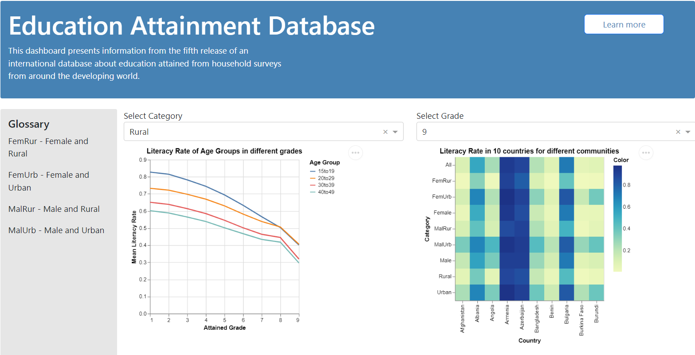

# Education Attainment App

The [Education Attainment Database](https://education-attainment-and-enrollment.onrender.com/) app is created to help policy makers / UN employees understand the state of academic literacy across the globe in developing nations.

This app consists of two plots with its own filters that the user can select to see the same graph for different kinds of filters.

The first plot is between grades attained and the mean literacy rate of all the countries for each age group. We can select a category of a social group - for eg. Urban, Rural, Male, Female, MalRur (Male and Rural), MalUrb (Male and Urban), FemRur (Female and Rural), FemUrb (Female and Urban). When looking at the graph we can make out that for all age groups and categories, we find the trend of the graph decreasing as the level of the grade increases. There are fewer people who achieved a higher grade. This seems intuitively quite obvious.

The second plot shows us a comparison of literacy rates for each of the 10 countries for each category of the society. We can also filter this by the grades they have completed. 

#
The following table of contents provides a overview of the Education Attainment Database app and its different sections, you can use the links below to easily navigate to the section of interest.

- [Introduction](#education-attainment-app)
- [Reproducing the processed data](#usage)
- [Required Python packages for data preprocessing](#requirements)
- [Developing the app locally](#developing-the-app-locally)
- [Contributions](#contributions)
- [License](#license)

# Dashboard Sketch



# Usage

General steps for reproducing the data preprocessing.

1. Clone [this](https://github.com/nik11susan/educational_attainment_and_enrollment_dash) GitHub repository

```
git clone https://github.com/nik11susan/educational_attainment_and_enrollment_dash.git
```

2. Navigate to the GitHub repository

```
cd educational_attainment_and_enrollment_dash
```

3. Install the required python packages listed in [here](https://github.com/nik11susan/educational_attainment_and_enrollment_dash/blob/main/src/requirements.txt) 

```
pip install -r env/requirements.txt
```

4. Run the data preprocessing script

```
python src/preprocessing.py
```


# Requirements

Required Python packages for data preprocessing.

```
altair~=4.2.2
openpyxl~=3.1.2
pandas~=1.5.3
dash~=2.9.1
gunicorn~=20.1.0
dash-bootstrap-components~=1.4.1
```


# Developing the app locally

If you are interested in running or developing the app locally, this section provides instructions on how to install and configure the necessary tools and dependencies to get started. 

To develop `educational_attainment_and_enrollment_dash` locally:
1. Clone this repository 

```   
git clone https://github.com/nik11susan/educational_attainment_and_enrollment_dash.git
```

2. Navigate to the GitHub repository

```
cd educational_attainment_and_enrollment_dash
```

3. Install the required python packages listed in [here](https://github.com/nik11susan/educational_attainment_and_enrollment_dash/blob/main/src/requirements.txt) 

```
pip install -r env/requirements.txt
```

3. Run the app server

```
python src/app.py
```

# Contributions
Interested in contributing? Please check out our [contributors' guidelines](CONTRIBUTING.md). 

It is important to maintain a welcoming and respectful environment while you contribute to the project. Before contributing, please take a moment to review the [code of conduct](CODE_OF_CONDUCT.md) to ensure that your contributions align with our values.

# License
Licensed under the terms of the MIT license.
Educational Attainment and Enrollment dataset taken from https://datacatalog.worldbank.org/search/dataset/0038973/Education-Attainment-and-Enrollment-around-the-World
